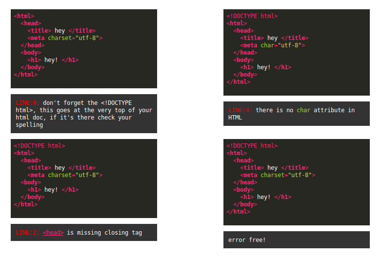

# html-friendly-linter
 this a kludgey quick+dirty html linter i wrote for various intro to html edu purposes ( class websites, demos, other tools ) specifically designed w/friendly errors for beginners to encourage best practices when writing HTML code. it's what i use in my [WWWEditor](https://github.com/nbriz/WWWEditor). the info in the html-elements-dictionary is scrapped from the [Mozilla Developer Network](https://developer.mozilla.org/en-US/docs/Web/HTML/Element) && html-attributes-dictionary is scrapped from both the [Mozilla Developer Network](https://developer.mozilla.org/en-US/docs/Web/HTML/Attributes#Attribute_list) + [w3schools](http://www.w3schools.com/tags/ref_attributes.asp)

# what it's doing

* checks for legit HTML tags
* checks that tags are closed ( if they're meant to be )
* checks for renegade closing tags ( ie. closing tags w/out openers )
* checks that singleton's don't have closing tags 
* checks for parsing errors caused by spaces in tags (ie. `< h1>` )
* checks for parsing errors caused by missing end-tags (ie. `</p > or </p ...` )
* checks for parsing errors caused by missing closing > in start-tags (ie `<p ...` )
* checks that attribute exist && is applicable to that tag
* checks that existing attributes are formatted properly
* checks that attribute isn't depreciated
* checks that doctype is right
* checks for consistency in usage of `<br>` vs `<br/>`
* checks for consistency `<DIV>` vs `<div>` 

# example use

 

 there's an example folder w/an example page in there. but here's the lowdown:

```javascript
// create linter object	
var html = new HTMLFriendlyLinter();
// pass lint method a string of html code
// returns an object with error messages
var errObj = html.lint( htmlString );
```

 if there's an error the 'errObj' returned above will look something like this:

```javascript
{
	message: '<head> is missing closing tag',

	html: '<a style="color:#F92672;" href="https://developer.mozilla.org/en-US/docs/Web/HTML/Element/head" title="The HTML <head> element provides general information (metadata) about the document, including its title and links to its&nbsp;scripts and style sheets." target="_blank">&lt;head&gt;</a> is missing closing tag',
	
	code: '<head>    <title> hey </title>    <meta charset="utf-8">  <body>    <h1> hey! </h1>  </body></html>'
}
```

 where 'message' is the plain text error message, 'html' is the error message formatted in html ( w/links to reference pages ) && 'code' is the html string that was passed into the linter starting at the point where it found the error


